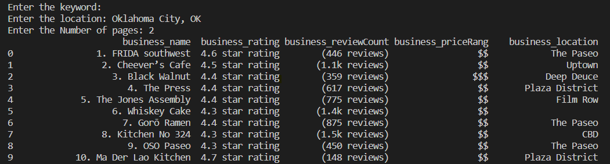

# Web Scraping with BeautifulSoup

This repository contains Python scripts and examples demonstrating web scraping using BeautifulSoup library. Web scraping is the process of extracting data from websites by parsing the HTML structure.

## Usage

Navigate to the desired script file in the repository and run it using Python. Each script is standalone and demonstrates a specific web scraping task using BeautifulSoup.

## Examples

This repository includes the following web scraping examples:

- Scrape job titles, locations, and company names from Indeed website based on a job keyword, location and number of pages.
- Scrape search results data(business name, rating, review count, pricing range and location) from Yelp website based on a keyword, location and number of pages.

Feel free to explore the examples and modify them to suit your scraping needs.

## Yelp Scraper output

